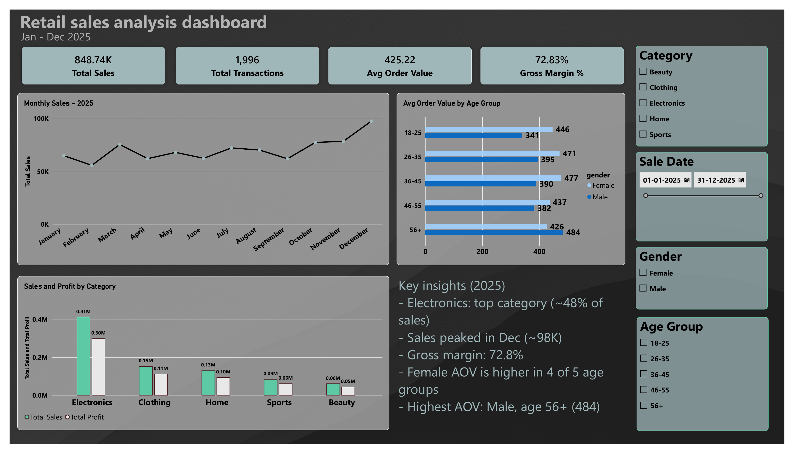

# Retail Sales Analysis (PostgreSQL + Power BI)

This is one of my SQL portfolio projects. I took a year of retail transactions (January to December 2025), worked through the data in PostgreSQL, and then built a Power BI dashboard to show the main numbers in one place.



## The data

The table has 1,996 transactions across 364 different dates. Every row is one sale: transaction id, date and time, customer id, gender, age, category (Beauty, Clothing, Electronics, Home or Sports), quantity, price per unit, cogs and the total sale amount.

## SQL

All the queries are in `sql/Retail_sales_analysis_project.sql`. I started by creating the table, checking the row count and looking for null values. The script also has a step to delete incomplete rows. After that I looked around the data a bit: number of unique customers, the categories, and total revenue, cost and profit.

The main part is a list of 15 questions I wanted to answer. A few examples: which category makes the most profit, what the profit margin of each category is, which customers buy from more than one category, which weekday has the highest revenue, how customers split into spending segments, and how revenue changes month by month. For these I used GROUP BY, HAVING, CTEs, subqueries, CASE and FILTER.

## Dashboard

I made the dashboard in Power BI from the same data. At the top there are four cards: total sales (848.74K), total transactions (1,996), average order value (425.22) and gross margin (72.83%). Below them is a monthly sales line, a chart of average order value by age group and gender, and sales and profit by category. The slicers on the right filter by category, date, gender and age group.

I added an Age Group column in DAX to group the ages, and a couple of measures for profit and margin:

```dax
Age Group =
SWITCH(TRUE(),
    RSA[age] <= 25, "18-25",
    RSA[age] <= 35, "26-35",
    RSA[age] <= 45, "36-45",
    RSA[age] <= 55, "46-55",
    "56+")

Total Profit = SUM(RSA[total_sale]) - SUM(RSA[cogs])

Profit Margin % = DIVIDE([Total Profit], SUM(RSA[total_sale]))
```

The margin is a gross margin (sales minus cogs, divided by sales), so rent, salaries and other running costs are not counted in it.

## What I found

- Electronics is the biggest category. It has about 0.41M in sales, roughly 48% of the total, and 0.30M in profit.
- December is the best month at around 98K, and the second half of the year does better than the first.
- Women have the higher average order value in four of the five age groups. Only in the 56+ group are men ahead, and that group also has the highest average order value overall.

| Age group | Female | Male |
|---|---|---|
| 18-25 | 446 | 341 |
| 26-35 | 471 | 395 |
| 36-45 | 477 | 390 |
| 46-55 | 437 | 382 |
| 56+ | 426 | 484 |

## Files

- `sql/` has the PostgreSQL script
- `dashboard/` has the Power BI file, a PDF export and a preview image

To look at the dashboard, open the `.pbix` file in Power BI Desktop.

## About me

I'm Karan Solanki, a B.Sc. Computer Applications student from Mumbai. I'm looking for an SQL / database internship.
